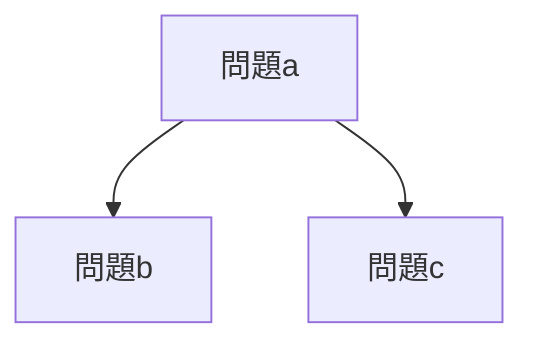

# ABC402-E 期待値dp

## 1. 期待値計算方法

まず期待値の計算方法について、整理します。
例えば以下のような場合を考えます。

1. まず問題aを提出します。
2. 次に問題aが解けた場合と、解けていない場合を考え、解けた場合は、問題bを提出します。
   解けていない場合は、問題cを提出します。



この場合期待値の計算方法は、
$E = (S_a + S_b)P_aP_b$
$\hspace{20pt} + (S_a + 0)P_a(1 - P_b)$
$\hspace{20pt} + (0 + S_c)(1 - P_a)P_c$
$\hspace{20pt} + (0 + 0)(1 - P_a)(1 - P_c)$
となります。

またa, b, cの選択方法は、各ノードにおいて、まだ解いていない問題を選択します。
各ノードの左側への道は、この問題を解いたこととする道であり、
右側への道は、まだこの問題を解いていない道である。

そのため問題bでは、問題の集合$T$から問題a以外の全ての問題について、選ぶことができ、
問題cでは、問題の集合$T$から問題aも含む全ての問題について、選ぶことができます。

またコストにについて、この木で表された全てのノードで提出したコストの総和ではなく、
一つの道の中にあるノードで提出したコストの総和になります。

従って、全探索することで、この問題の解を導くことができます。
ただし、この方法では、各ノードにおいて、問題の集合$T$を全て探索しないといけないため、
計算量は、$提出することができる問題数 ^ 2 \times 総問題数$ となります。

メモ化再帰することで、高速化できますが、入力例4が通りませんでした。（実装が悪い？）

では上記の式で漸化式が作成可能かを考えてみます。
まず問題aが解けた場合、を考えます。
ここで終了する場合、ここでは$S_a \times P_a$を返します。
しかし、まだコストが残っているため、さらに再帰します。
次に問題bを提出する。このとき、コストが無くなった場合、
$(S_a + S_b)P_aP_b + (S_a + 0)P_a(1 - P_b)$
を返します。
しかしこの方法では最終的な結果が最下層にたどり着くまで分かりません。
そこで、動的計画法を用いるために、漸化式を作りたいと思います。
漸化式を作るにあたってそこまでの結果を用いて次のノードの計算またはその逆が出来るようにします、
つまり、
$S_aP_aA + B = (S_a + S_b)P_aP_b + (S_a + 0)P_a(1 - P_b)$
となるA、Bを求めれば良い。
まず右辺について、展開すると
$右辺 = (S_a + S_b)P_aP_b + (S_a + 0)P_a(1 - P_b)$
$\hspace{22pt} = S_aP_aP_b + S_bP_aP_b + S_aP_a - S_aP_aP_b$
$\hspace{22pt} = S_bP_aP_b + S_aP_a$
$\hspace{22pt} = S_aP_a(\frac{S_bP_b}{S_a} + 1)$
従って、
$A = P_b + 1$

入力例1

```
3 2
100 1 50
200 1 20
1000 1 1
```

出力

```
95
```
